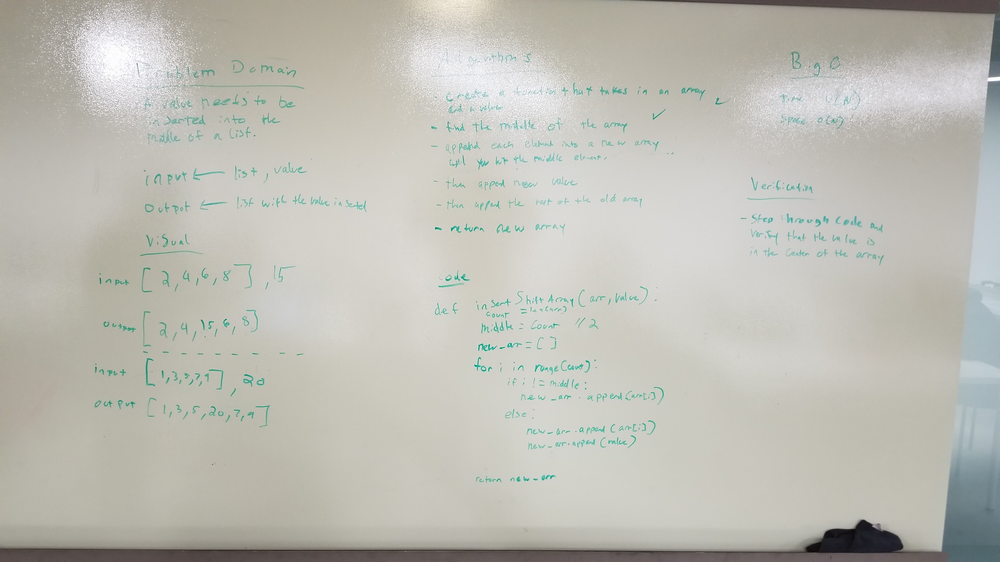

# Insert new value into array at middle index
This is a function that will take in an array and a value as arguments.  If they array length is an even number, it will add the value into the middle of the array. If the array length is an odd number, it will add the value immediately after the current middle index.

## Collaboration
Chris Ball & Dan Le worked together to whiteboard the solution and then we wrote our actual solutions individually.

## Challenge
Write a function called `insertShiftArray` which takes in an array and the value to be added. Without utilizing any of the built-in methods available to your language, return an array with the new value added at the middle index.

## Approach
We decided to iterate through the original array, adding each element to a new array. When we hit the middle of the array, we add the new value to the new array, and then we continue iterating through the original array, appending the values to the new array.

## Efficiency
Time = O(n)
Space = O(n)

## Solution
