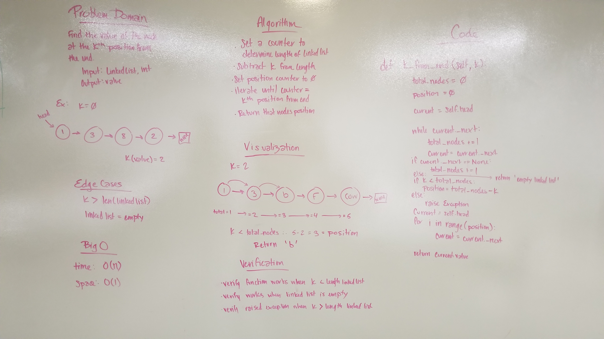

# Linked List Kth From End
Returning the value of the Kth node in a Linked List.

## Challenge
Write a method to return the value of the kth node in a Linked List.

## Approach
We determined the length of the list to ensure k < length of the list. If so, we subtracted k from the length to determine how many nodes we would be moving forward. Then we moved forward that many and returned the value of the current node.

## Efficiency
Time O(n)
Space O(1)

## Solution
