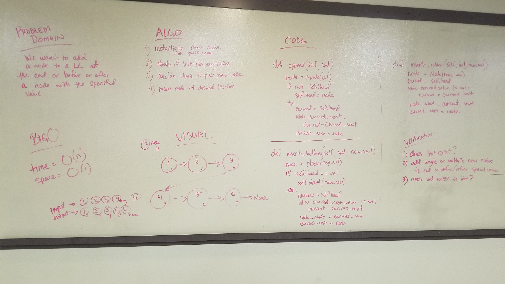

# Linked List Insertions
Inserting new nodes into a linked list.

## Challenge
Write methods for adding new nodes to the linked list at the end or before or after a node with the given value.

## Approach
For the .append() method, we traversed the linked list and found the location where the node._next value was falsy and then we inserted the node after that node.

For the .add_before() method, we traversed the linked list and found the node with a .next whose value matched the specified value, then we inserted the new node after that current node.

For the .add_after() method, we traversed the linked list and found the node with a value that matched the specified value, then we inserted the node after that current node.

## Efficiency
Time O(n)
Space O(1)

## Solution

