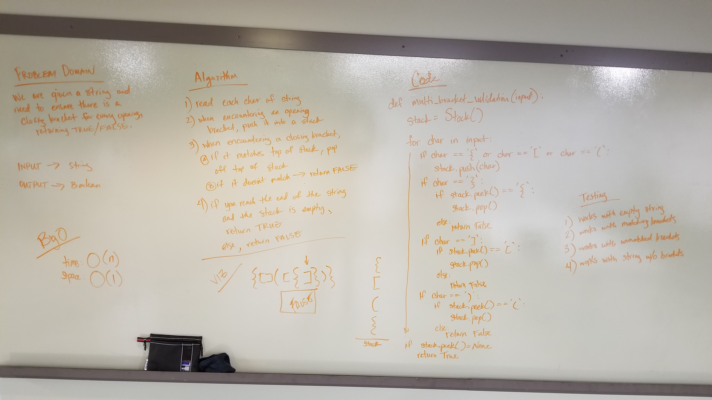

# Multi Bracket Validation
We needed a function that would confirm whether there were matching closing brackets for every opening bracket in a string.

## Challenge
- Your function should take a string as its only argument, and should return a boolean representing whether or not the brackets in the string are balanced. There are 3 types of brackets:

    - Round Brackets : ()
    - Square Brackets : []
    - Curly Brackets : {}

## Approach
I chose to create a stack and push all opening brackets into the stack. Any time I encountered a closing bracket, I would compare it to the top of the stack. If it matched, I popped it from the stack. If it didn't match, the function returned False. If there are no brackets in the stack at the end of the string, the return value is True.

## Efficiency
Time O(n) Space O(1)

## Solution
