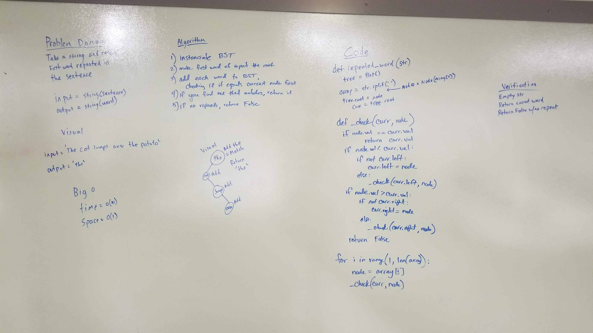

# Repeated Word
This function takes in a string and checks to see if any of the words are repeated. If there is a repeat, it will return a string of the first word that is repeated. If there are no repeats, it will return False.

## Challenge
- Write a function that accepts a lengthy string parameter.
- Without utilizing any of the built-in library methods available to your language, return the first word to occur more than once in that provided string.

## Approach
I split the input string into an array so I could iterate through it with each word. I instantiated a binary search tree with the root set to the first element in the array. I created a function that compares the next word with the existing words in the tree using a pre-order traversal. If the values don't match on the root, it calls itself recursively using the left (if it exists) and the right (if it exists). If a match is found, it returns that match. If no match is found, it will return False.

## Efficiency
BigO of time is O(n). BigO of space is O(1).

## Solution
