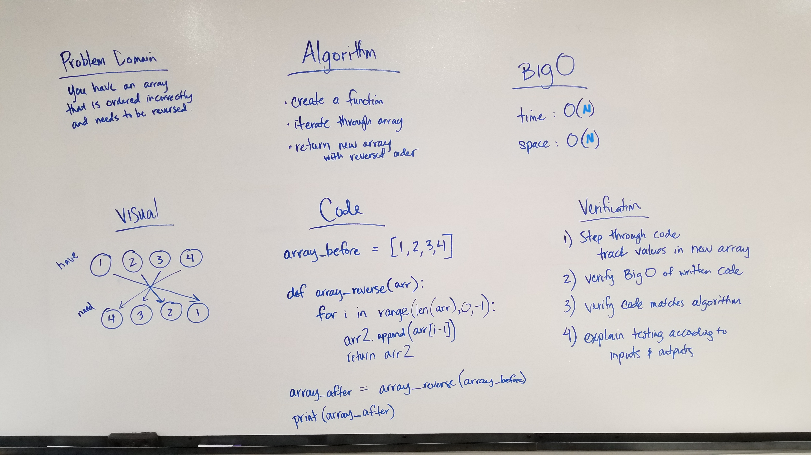

# Reverse an Array

This is a function that takes in an array and returns the array in reverse.

## Challenge

The challenge was to take in an input array and return the array in reverse order.

## Approach & Efficiency

I took the approach of iterating through the input array backwards and appending each element into a new array, then return the new array. This seemed like the most logical approach, given that we could not use the reverse method. I also considered swapping the first and last elements and then step in 1 element from the beginning and end and swap those, etc. 

The BigO of this function is O(n) for time and O(n) for space. The number of steps goes up proportional to the size of the input array. The size becomes larger proportional to the size of the input array.

## Solution

