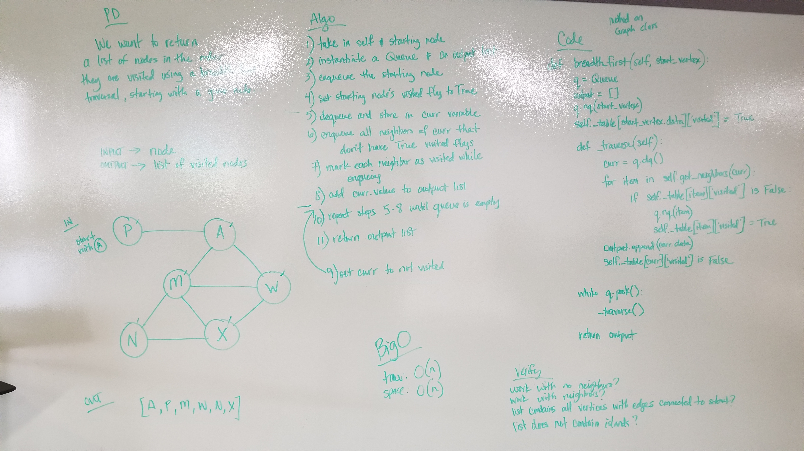

# Breadth First Graph Traversal
Function that takes in a graph and a starting node and returns a list of all of the nodes traversed in a breadth first order.

## Challenge
- Extend your graph object with a breadth-first traversal method that accepts a starting node. Without utilizing any of the built-in methods available to your language, return a collection of nodes in the order they were visited. Display the collection.

## Approach
- 

## Efficiency
- The BigO of time is O(n^2) because worst case would be an edge connecting every vertex in the graph.
- The BigO of space is O(n) because the output list would only be as large as the number of vertices in the graph.

## Solution

