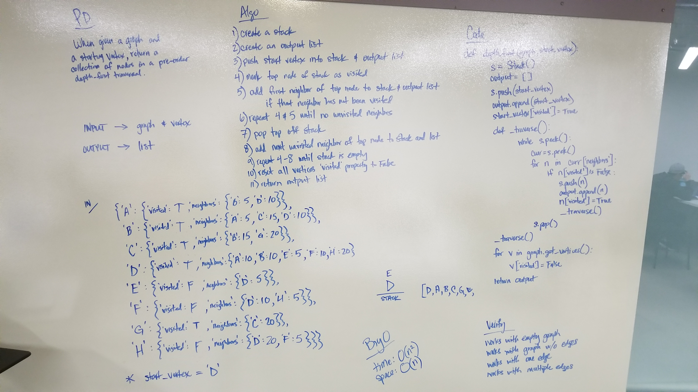

# Pre-Order Depth First Graph Traversal
Function that takes in a graph and a starting node and returns a list of all of the nodes traversed in a breadth first order.

## Challenge
- 

## Approach
- 

## Efficiency
- 

## Solution

