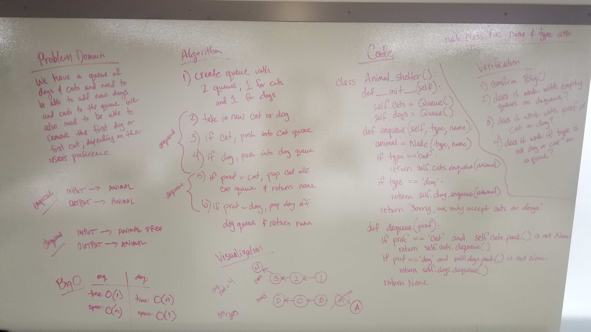

# FIFO Animal Shelter
Animal Shelter that takes only dogs or cats and can return the dog or cat that has been in the shelter longest, depending on the species requested.

## Challenge
- Create a class called AnimalShelter which holds only dogs and cats. The shelter operates using a first-in, first-out approach.
- Implement the following methods:
    - enqueue(animal): adds animal to the shelter. animal can be either a dog or a cat object.
    - dequeue(pref): returns either a dog or a cat. If pref is not "dog" or "cat" then return null.

## Approach
I decided to create a queue class that was instantiated with two internal queues; one for cats, and one for dogs. I then used the internal queue methods within my external queue methods in order to add the cats to the cats queue and the dogs to the dogs queue. If the adopter requests a cat, I dequeue the cat at the front of the cat queue. If the adopter requests a dog, they get the dog at the front of the dog queue.

## Efficiency
enqueue method: Time O(1) Space O(n)  
dequeue method: Time O(n) Space O(1)

## Solution
