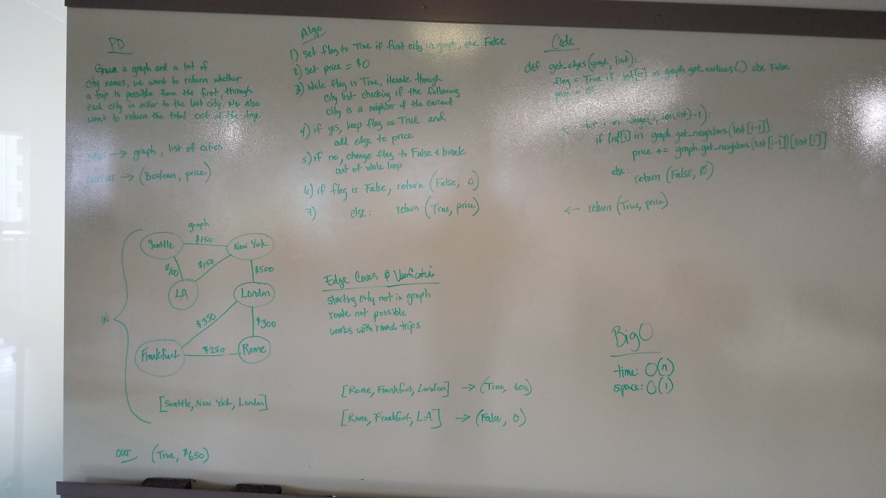

# Get Edges
Function that takes in a graph and a list. It determines whether there are edges connecting the first element to the next element, etc. through the end of the list. It will return a tuple of a boolean and the total of all the edges added together. If there is no path from the first element to the last element, the return will be (False, 0).

## Challenge
- Write a function based on the specifications above, which takes in a graph, and an array of city names. Without utilizing any of the built-in methods available to your language, return whether the full trip is possible with direct flights, and how much it would cost.

## Approach
- I created a variable called price to hold the total sum of all the edges.
- I then check to ensure the list has more than 1 item in it.
    - If not, I return (False, 0) because there's no sense in going further.
- Then I run through the list, starting with the second element.
    - I check to see if the second element is a neighbor of the first element.
    - If so, I add the edge value to the price variable.
    - If not, I return (False, 0
- Finally, I return (True, price) where price will be the aggregated total of all edges along the path.

## Efficiency
- BigO for time is O(n) because the input list could be the same size as the input graph and has to iterate through all but 1 item in the list.
- BigO for space is O(n) because I am using variables inside the function that could be the same size as the input graph.

## Solution

