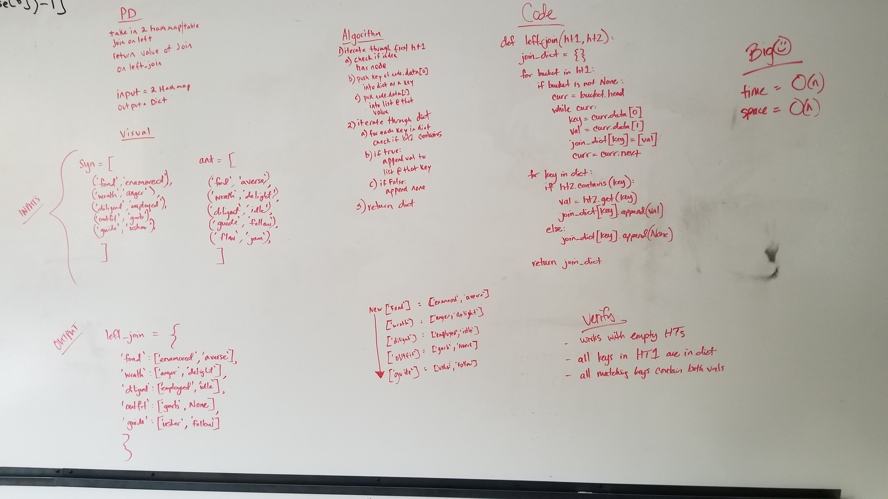

# Left Join Two Hashtables
This function takes in two hashtables and returns a dictionary representing a left join of the two tables. All keys found in the first hashtable will be in the dict. The values of each key of the dict will be a list containing the value of the key in the first hashtable and, if the key exists in the second hashtable, the value of that key. If the key does not exist in the second hashtable, the list will contain `None`. 

## Challenge
- Write a function that LEFT JOINs two hashmaps into a single data structure.
- The first parameter is a hashmap that has word strings as keys, and a synonym of the key as values.
- The second parameter is a hashmap that has word strings as keys, and antonyms of the key as values.
- Combine the key and corresponding values (if they exist) into a new data structure according to LEFT JOIN logic.
- LEFT JOIN means all the values in the first hashmap are returned, and if values exist in the “right” hashmap, they are appended to the result row. If no values exist in the right hashmap, then some flavor of NULL should be appended to the result row.
- The returned data structure that holds the results is up to you. It doesn’t need to exactly match the output below, so long as it achieves the LEFT JOIN logic.
- Avoid utilizing any of the library methods available to your language.

## Approach
- I iterated through the first hashtable, pushing the data from any buckets containing nodes into a new dictionary.
    - In the dictionary, the keys are the node.data[0], and the value of each key is node.data[1].
- I then iterated through the dictionary and checked to see if the second hashtable contained any of they keys in the dictionary.
    - If so, I append the value at that key in the hashtable to the list at that value in the key of the dictionary.
    - If not, I append None to the list at that value in the key of the dictionary.

## Efficiency
- BigO of time is O(n).
- BigO of space is O(n).

## Solution
