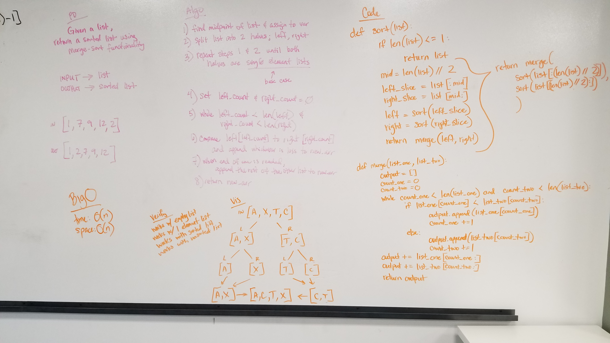

# Merge Sort
Funtion to sort an array by splitting the size of the sorted items down to the smallest amount and then merging those portions back together to return the full sorted array.

## Challenge
- Write a function that accepts an array of unsorted integers, and returns a sorted array by a recursive mergesort algorithm.

## Approach
- If the list contains one item or less, I just return the list.
- Otherwise, I find the middle, and make variables for the left half and the right half.
- Then I recurse the function using those halves.
- Then I return an internal function call passing in the returns of the recursed halves.
- The internal function is creating an empty list and two counter variables.
- While each counter variable is less than the length of its respective list, I compare the lists at the index of their respective counter.
- Whichever value is less gets pushed into the output array and then that counter is incremented.
- Once one of the counters reaches the length of its list, I append the rest of both lists to the end of the output list and return the output list.

## Efficiency
Time O(n*log(n))
Space O(n)

## Solution

