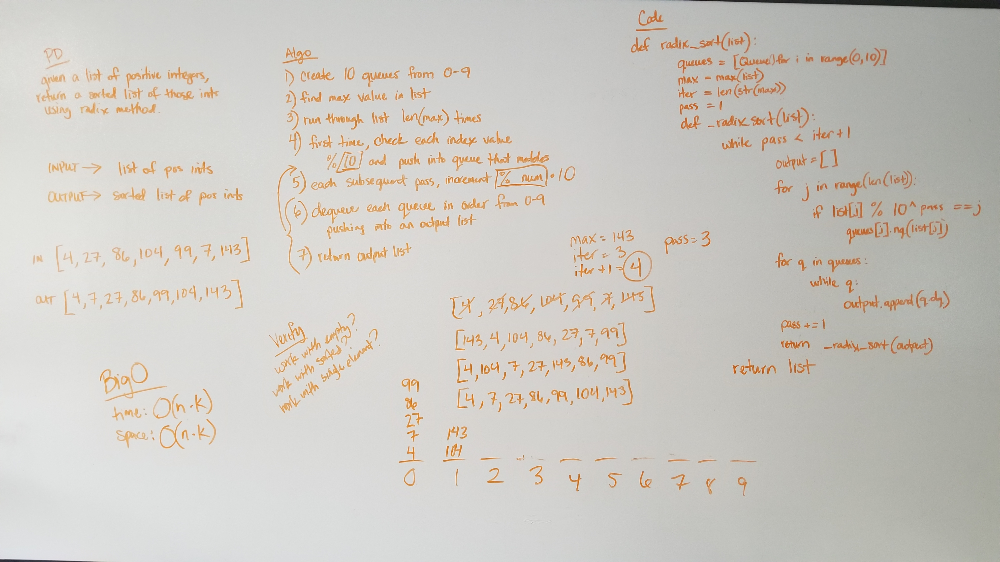

# Radix Sort
Function that takes in a list and returns a list that has been sorted using radix methodology.

## Challenge
- Write a function that accepts an array of positive integers, and returns an array sorted by a radix sort algorithm.

## Approach
- I created a list of 10 queues
- I figured out the max value inside the list and created a variable that represented the number of digits that value has. That variable is then used for the number of iterations.
- I created a variable for which loop I'm on, starting at 0.
- I have an interior function that recurses while the loop number is less than the numer of iterations.
- Inside that interior function, I create an empty list.
- For each number in the original list, I compare the ones value of each number and push each number into one of the queues in my list of queues, based on whether the index of the queue list matches the value at the ones digit.
- Then I repeat the process for each digit; tens, hundreds, etc. until I reach the iterations value.
- Then I dequeue each queue in the list until it's empty, pushing it's dequeued value into the empty list I created.
- I then increment the loop number and return that interior function using the list I just created as the argument.
- Once the loop number is no longer less than the number of iterations, I return the list.
- Lastly, I call the interior function using the original list passed into the radix_merge function.

## Efficiency
I believe the BigO for time and space is O(n * k).

## Solution

