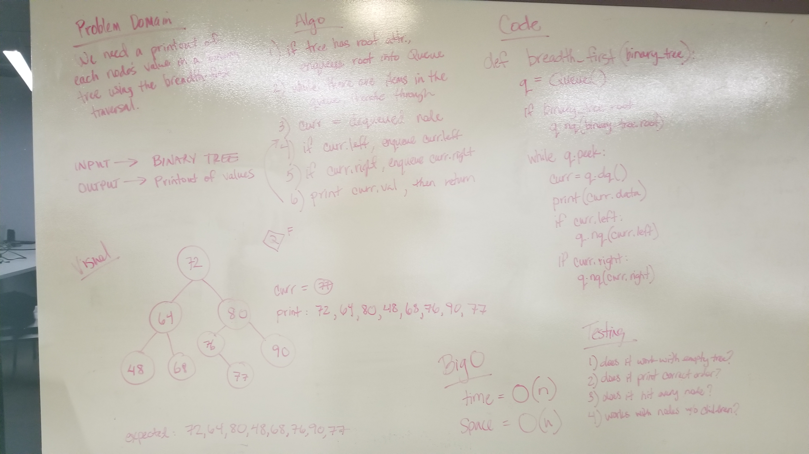

# Binary Trees
Classes for Binary Tree and Binary Search tree that establish pre-order, post-order, and in-order traversals and the ability to add a value to a tree and check to see if a value exists within a tree.

BinaryTree class also has a method called `breadth_first_traversal` that takes in the tree and runs a breadth first traversal through the tree, printing each node's *data* attribute.

## Challenge
- Create a Node class that has properties for the value stored in the node, the left child node, and the right child node.
- Create a BinaryTree class
- Define a method for each of the depth first traversals called preOrder, inOrder, and postOrder which returns an array of the values, ordered appropriately.
- At no time should an exception or stack trace be shown to the end user. Catch and handle any such exceptions and return a printed value or operation which cleanly represents the state and either stops execution cleanly, or provides the user with clear direction and output.

- Create a BinarySearchTree class
- Define a method named add that accepts a value, and adds a new node with that value in the correct location in the binary search tree.
- Define a method named contains that accepts a value, and returns a boolean indicating whether or not the value is in the tree at least once.

- Write a breadth first traversal method which takes a Binary Tree as its unique input. Without utilizing any of the built-in methods available to your language, traverse the input tree using a Breadth-first approach; print every visited node’s value.

## Approach
For the traversals, I used recursion to search through the tree. The only difference was when the node itself was being pressed into the array.
For the add method, I used recursion to run the function again if the current node had a left or a right, depending on whether the data was less than or greater than the current node's data value.
For the contains method, I used recursion to run the function again if the data value did not equal the current node's data value and it had a left or a right. 

## Efficiency
The traversals are all O(n) for time and space.
The add and contains methods are O(log(n)) for time and O(1) for space.

## Solution

